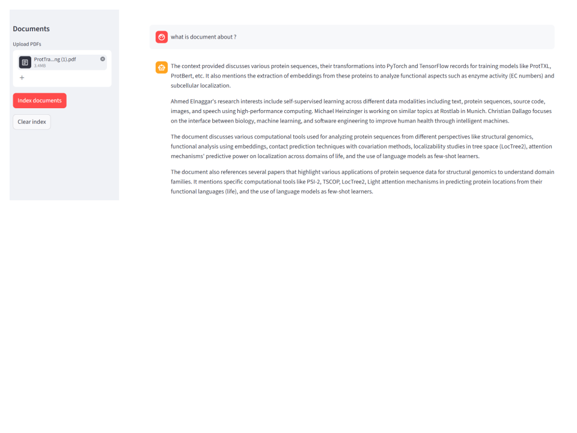

# Multi-Document RAG

A local RAG (Retrieval-Augmented Generation) system that lets you upload PDF documents and ask questions about them — fully offline, no cloud required.

## Stack

| Component | Library / Model |
|-----------|----------------|
| UI | Streamlit |
| LLM | DeepSeek-R1-Distill-Qwen-1.5B (llama.cpp) |
| Embeddings | nomic-ai/nomic-embed-text-v1.5 |
| Vector DB | ChromaDB |
| Orchestration | LangChain |

## Setup

### 1. Create virtual environment (Python 3.12)

```bash
py -3.12 -m venv .venv
.venv\Scripts\activate
```

### 2. Install dependencies

```bash
pip install langchain langchain-community langchain-huggingface langchain-chroma langchain-text-splitters langchain-core pypdf sentence-transformers streamlit einops
pip install https://github.com/abetlen/llama-cpp-python/releases/download/v0.3.19/llama_cpp_python-0.3.19-cp312-cp312-win_amd64.whl
```

### 3. Download a GGUF model

```python
from huggingface_hub import hf_hub_download
hf_hub_download(
    repo_id="bartowski/DeepSeek-R1-Distill-Qwen-1.5B-GGUF",
    filename="DeepSeek-R1-Distill-Qwen-1.5B-Q4_K_M.gguf",
    local_dir="./models"
)
```

### 4. Update model path in `app.py`

```python
MODEL_PATH = r"C:\path\to\your\model.gguf"
```

### 5. Run

```bash
.venv\Scripts\python.exe -m streamlit run app.py
```

Open **http://localhost:8501** in your browser.

## Usage

1. Upload one or more PDF files using the sidebar
2. Click **Index documents** to build the vector database
3. Ask questions in the chat input
4. Click **Clear index** to reset and start with new documents

## Configuration

Edit the top of `app.py`:

| Variable | Description |
|----------|-------------|
| `MODEL_PATH` | Path to your local GGUF model |
| `N_CTX` | Context window size (default: 4096) |
| `N_GPU_LAYERS` | GPU layers to offload (0 = CPU only) |
| `CHROMA_DIR` | Vector DB storage folder |
| `UPLOAD_DIR` | Folder where uploaded PDFs are saved |

## Switching Models

Uncomment the desired `MODEL_PATH` in `app.py`:

```python
MODEL_PATH = r"...\DeepSeek-R1-Distill-Qwen-1.5B-Q4_K_M.gguf"
# MODEL_PATH = r"...\Qwen3-4B-Q4_K_M.gguf"
# MODEL_PATH = r"...\Qwen3.5-0.8B-Q5_K_M.gguf"
```

Note: If you change the embedding model, delete the `chroma_db_*` folder and re-index.

## Demo


